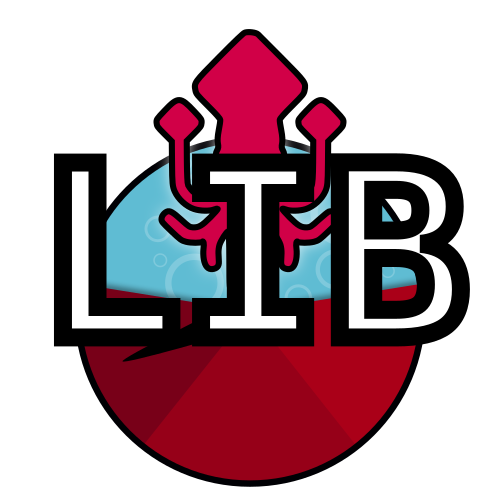

[](https://gitlab.inria.fr/dh-projects/kami/kami-lib/-/pipelines) [](https://gitlab.inria.fr/dh-projects/kami/kami-lib/-/commits/master) [](https://gitlab.inria.fr/dh-projects/kami/Kami-lib/master/LICENSE) 

 

# KaMI (Kraken Model Inspector)

<!---->


Python package focused on HTR / OCR models evaluation and based on the [Kraken](http://kraken.re/) transcription system.

## :electric_plug: Installation

### Dependencies 

Kami requires : 

* Python (<=3.8)
* Kraken (==3.0.0.0b24)

### User installation 

Use pip to install package:

`$ pip install kamilib`


### Developer installation 

1. Create a local branch of the kami-lib project :

```bash
$ git clone https://gitlab.inria.fr/dh-projects/kami/kami-lib.git
```

2. Create a virtual environment :

```bash
$ virtualenv -p python3.7 kami_venv
```

then 

```bash
$ source kami_venv/bin/activate
```

3. Install dependencies with the requirements file

```bash
$ pip install -r requirements.txt
```

4. Run the tests 

```bash
$ python -m unittest tests/*.py -v
```

## :runner: Tutorial

Access to a "end-to-end pipeline" example that use Kami (FR tutorial) : [](https://colab.research.google.com/drive/1nk0hNtL9QTO5jczK0RPEv9zF3nP3DpOc?usp=sharing)

## :key: Quickstart

<!-- You can launch binder to see notebook with tutorial too -->

```python

# import package 
import pprint
from kami.Kami import Kami

# Select ground truth (raw text, sequences and XML PAGE also support), 
# image (.jpeg/.jpg only), 
# and  transcription model (.mlmodel only, you can use Kraken to create one).
# Tips : Use files in datatest/ directory to test freely
file = "datatest/text_jpeg/GT_1.txt"
image = "./datatest/text_jpeg/Voyage_au_centre_de_la_[...]Verne_Jules_btv1b8600259v_16.jpeg"
model = "./datatest/on_hold/KB-app_model_JulesVerne1_best.mlmodel"

# Create a kami object

k = Kami(file,  # Apply ground truth file here
         model=model,  # Apply HTR/OCR model here
         image=image,  # Apply image here
         apply_transforms="XP",  # Compute with some transformations as remove diacritics and punctuations
         # (List transformations : D : digits / U : uppercase / L : lowercase / P : punctuation / X : diacritics [OPTIONAL])
         verbosity=False,  # Add some comments during process
         truncate=True,  # Truncate final scores
         percent=True,  # Indicate scores in percent
         round_digits='0.01')  # number of digits after floating point

# Get the reference text
print(k.reference)

print(f"\n{'-' * 20}\n")

# Get the prediction text
print(k.prediction)

print(f"\n{'=' * 20}\n")

# Get the reference modified with transforms
print(k.reference_preprocess)

print(f"\n{'*' * 20}\n")

# Get the prediction modified with transforms
print(k.prediction_preprocess)

print(f"\n{'*' * 20}\n")

# Get all scores
pprint.pprint(k.scores.board)

{'Length_prediction': 2507,
      'Length_prediction_transformed': 2405,
      'Length_reference': 2536,
      'Length_reference_transformed': 2426,
      'Total_char_removed_from_prediction': 102,
      'Total_char_removed_from_reference': 110,
      'Total_diacritics_removed_from_prediction': 84,
      'Total_diacritics_removed_from_reference': 98,
      'all_transforms': {'cer': 5.81,
                         'cil': 8.38,
                         'cip': 91.61,
                         'deletions': 48,
                         'hamming_distance': 'Ø',
                         'hits': 2312,
                         'insertions': 27,
                         'levensthein_distance_char': 141,
                         'levensthein_distance_words': 73,
                         'mer': 5.74,
                         'substitutions': 66,
                         'wacc': 82.28,
                         'wer': 17.71},
      'default': {'cer': 6.62,
                  'cil': 9.55,
                  'cip': 90.44,
                  'deletions': 59,
                  'hamming_distance': 'Ø',
                  'hits': 2398,
                  'insertions': 30,
                  'levensthein_distance_char': 168,
                  'levensthein_distance_words': 90,
                  'mer': 6.54,
                  'substitutions': 79,
                  'wacc': 79.54,
                  'wer': 20.45},
      'remove_diacritics': {'cer': 6.08,
                            'cil': 8.78,
                            'cip': 91.21,
                            'deletions': 49,
                            'hamming_distance': 'Ø',
                            'hits': 2379,
                            'insertions': 31,
                            'levensthein_distance_char': 152,
                            'levensthein_distance_words': 77,
                            'mer': 6.0,
                            'substitutions': 72,
                            'wacc': 82.05,
                            'wer': 17.94},
      'remove_punctuation': {'cer': 6.37,
                             'cil': 9.25,
                             'cip': 90.74,
                             'deletions': 57,
                             'hamming_distance': 'Ø',
                             'hits': 2330,
                             'insertions': 25,
                             'levensthein_distance_char': 157,
                             'levensthein_distance_words': 86,
                             'mer': 6.31,
                             'substitutions': 75,
                             'wacc': 79.71,
                             'wer': 20.28}}

```

## :wrench: Improvements

* Formats

    -  Integrate other ground truth formats as ALTO XML
    -  Integrate other HTR / OCR model formats
    
* Compute

    - Speed up 
    - Integrate the evaluation of the image segmentation


<!--
## :bulb: Usage

- Ground truth formats (alto/txt) + model format
- comparer deux séquences de caractères
- options de preprocessing (codes lettres)
- types de métriques (article de réf.)

## :sparkles: History & Motivation
-->

## :question: Do you have questions, bug report, features request or feedback ?

#### Please use the issue templates :

#### :beetle: Bug report : [here](https://gitlab.inria.fr/dh-projects/kami/kami-lib/-/issues/new?issuable_template=bug_report)
#### :fireworks: Features request : [here](https://gitlab.inria.fr/dh-projects/kami/kami-lib/-/issues/new?issuable_template=feature_request)

*if you are not in these cases, feel free to open an issue*

## :black_nib: How to cite 

```
@misc{Kami-lib,
    author = "Lucas Terriel (Inria - ALMAnaCH) and Alix Chagué (Inria - ALMAnaCH)",
    title = {Kami-lib - Kraken model inspector},
    howpublished = {\url{https://gitlab.inria.fr/dh-projects/kami/kami-lib}},
    publisher = {GitLab-inria},
    year = {2020-2021}
}
```

## :octopus: License and contact

Distributed under [MIT](./LICENSE) license. The dependencies used in the project are  also distributed under compatible 
license.

Mail authors and contact : Alix Chagué (alix.chague@inria.fr) and Lucas Terriel (lucas.terriel@inria.fr) 

*Kami* is developed and maintained by authors (since 2021, first version named Kraken-Benchmark in 2020) 
with contributions of [ALMAnaCH](http://almanach.inria.fr/index-en.html) at [Inria](https://www.inria.fr/en) Paris.


[](https://www.python.org/)
